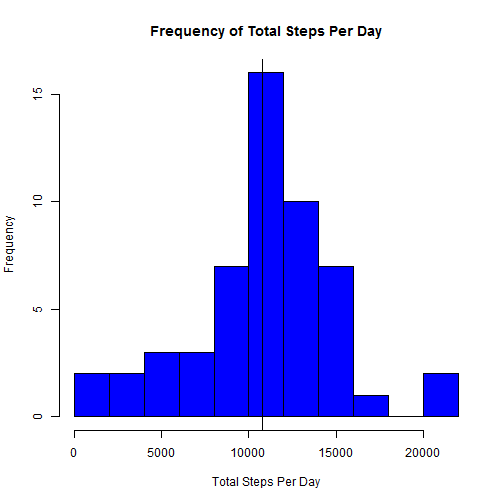
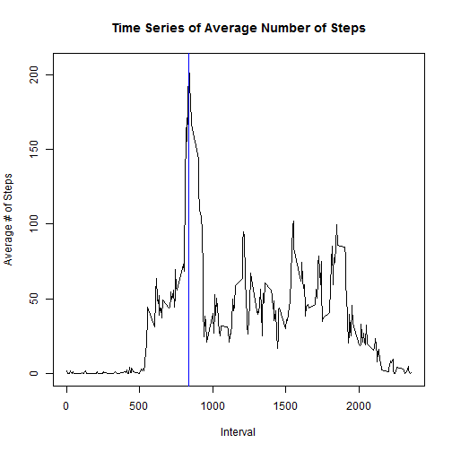
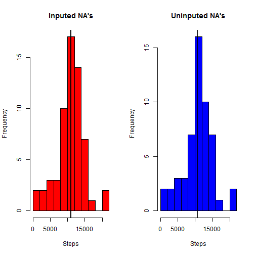
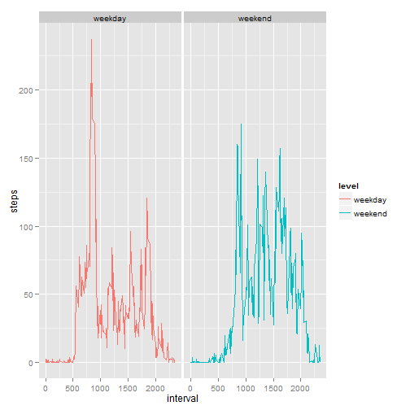

Reproducible Research: Peer Assesment 1
=======================================


### Introduction
It is now possible to collect a large amount of data about personal movement using activity monitoring devices such as a Fitbit, Nike Fuelband, or Jawbone Up among others. These type of devices are part of the "quantified self" movement - a group of enthusiasts who take measurements about themselves regularly to improve their health, to find patterns in their behavior, or because they are tech geeks.

This assignment makes use of data from a personal activity monitoring device. This device collects data at 5 minute intervals through out the day. The data consists of two months of data from an anonymous individual collected during the months of October and November, 2012 and include the number of steps taken in 5 minute intervals each day.

### Loading the Data
First let's go ahead and load the data into R and take a quick look at it (we're assuming that the working directory already contains the file).

```r
activity <- read.csv("activity.csv")
summary(activity)
```

```
##      steps               date          interval   
##  Min.   :  0.0   2012-10-01:  288   Min.   :   0  
##  1st Qu.:  0.0   2012-10-02:  288   1st Qu.: 589  
##  Median :  0.0   2012-10-03:  288   Median :1178  
##  Mean   : 37.4   2012-10-04:  288   Mean   :1178  
##  3rd Qu.: 12.0   2012-10-05:  288   3rd Qu.:1766  
##  Max.   :806.0   2012-10-06:  288   Max.   :2355  
##  NA's   :2304    (Other)   :15840
```
The first thing we should note it the 2,304 NA's in the data set. This makes up roughtly 13% of all the data points. For this first part we will simply omit these data points in our calculation. We will address them in the latter half of this assignment.

### What is mean total number of steps taken per day?
We will use the aggregate function to answer this question. First we will sum the total number of steps taken per day and take a look at the summary of our new data frame.


```r
summed <- aggregate(steps ~ date, data = activity, FUN=sum, na.rm=TRUE)

summary(summed)
```

```
##          date        steps      
##  2012-10-02: 1   Min.   :   41  
##  2012-10-03: 1   1st Qu.: 8841  
##  2012-10-04: 1   Median :10765  
##  2012-10-05: 1   Mean   :10766  
##  2012-10-06: 1   3rd Qu.:13294  
##  2012-10-07: 1   Max.   :21194  
##  (Other)   :47
```
We can note from this summary that the mean is 10,766 steps per day and the median is 10,765.

We can plot a histogram of the data to get a better vizualization of the spread. We will also plot the lines where the mean and median are in relation to the histogram. Though, given how close the numbers are they will only show up as one solid line.


```r
hist(summed$steps, breaks=10, col="blue", xlab="Total Steps Per Day", main = "Frequency of Total Steps Per Day")
abline(v=mean(summed$steps))
abline(v=median(summed$steps))
```

 

###What is the average daily activity pattern?
Again, we will use the aggregate function for this question. This time we will average the numbers of steps taken in each interval. We can then use the which.max function to find which interval has the maximum average number of steps.


```r
avg <- aggregate(steps~interval, data=activity, FUN=mean, na.rm=TRUE)

avg[which.max(avg$steps),]
```

```
##     interval steps
## 104      835 206.2
```

We find that the maximum number of steps is 206.2 at the 835 interval. Again let us plot this to get a better visual of it.


```r
plot(avg, type="l", xlab= "Interval", ylab="Average # of Steps", main = "Time Series of Average Number of Steps")
abline(v=avg$interval[which.max(avg$steps)], col = "blue")
```

 

###Imputing missing values
As we noted earlier, there are 2,304 NA's in our data set that we simply ignored for our previous calculations. For this portion, we will fill in the missing values using the mean for that 5-minute interval by day of the week.

We will do the following to get our new dataset.

1\. Add a new column of the day of the week.

```r
activity$date <- as.Date(activity$date, "%Y-%m-%d") ##currently has class factor

activity$day <- weekdays(activity$date)
```

2\. Split the data into two: complete cases and all missing values.

```r
complete <- activity[complete.cases(activity),]

incomplete <- activity[!complete.cases(activity), 2:4] ## leave off steps column
```

3\. Create a new aggregate data frame based on the complete cases data frame for average steps by day by interval.

```r
avgcomplete <- aggregate(steps~day+interval, data=complete, FUN=mean)
```

4\. Add the average numbers of steps to the incomplete cases data frame using the aggregate data frame we just created.

```r
completed <- merge(incomplete, avgcomplete, by=c("day", "interval"))
```

5\. Recombine the split frames to produce our new dataset with the missing data filled in.

```r
allcomplete <- rbind(completed, complete)
```

Now let us aggregate our new dataset  the same way we did for the first part. We can also plot the histogram and compare it to our first one.

```r
sumcomplete <- aggregate(steps ~ date, data=allcomplete, FUN=sum)

par(mfrow=c(1,2))

hist(sumcomplete$steps, breaks=10, col="red", xlab="Steps", main="Inputed NA's")
abline(v=mean(sumcomplete$steps))
abline(v=median(sumcomplete$steps))

hist(summed$steps, breaks=10, col="blue", xlab="Steps", main="Uninputed NA's" )
abline(v=median(summed$steps))
```

 

```r
summary(sumcomplete)
```

```
##       date                steps      
##  Min.   :2012-10-01   Min.   :   41  
##  1st Qu.:2012-10-16   1st Qu.: 8918  
##  Median :2012-10-31   Median :11015  
##  Mean   :2012-10-31   Mean   :10821  
##  3rd Qu.:2012-11-15   3rd Qu.:12811  
##  Max.   :2012-11-30   Max.   :21194
```

As expected the mean and median have shifted from those that we calculated earlier with the NA's simply removed.

###Are there differences in activity between weekdays and weekends?

For this question we will need to add a new factor variable with two levels - "weekend" and "weekday". For our previous problem we already added a column for day of the week. We can run a simple for loop based on that data to give us our new column.


```r
allcomplete$level <- NA ## create our new column

## if the value in the day column is either "Saturday" or "Sunday" we will place the value of "weekend" in the level column, otherwise it will be listed as "weekday"
for (i in 1:nrow(allcomplete)) {
if(allcomplete$day[i] %in% c("Saturday", "Sunday")) {
    allcomplete$level[i] <- "weekend"
    } else { 
    allcomplete$level[i] <- "weekday"}
}

allcomplete$level <- as.factor(allcomplete$level) ## the class is currently "character", so we need to change it to class "factor".
```

Now that we have our new column we can again aggregate the data frame and create our plot to compare the two levels. We will use the ggplot2 package for this, as it is a bit more user friendly for this type of plot.


```r
avgbylevel <- aggregate(steps~level+interval, data=allcomplete, FUN=mean)

library(ggplot2) ##load the ggplot2 package

ggplot(avgbylevel, aes(x=interval, y=steps, col=level)) + geom_line() + facet_grid(.~level)
```

 

A cursory review of the plot reveals that there is indeed a difference in average activty between weekday and weekends. Where weekdays show a single spike of high activity surrounded by moderate and low activity, weekends appear to have continuous levels of moderate to high activity.
